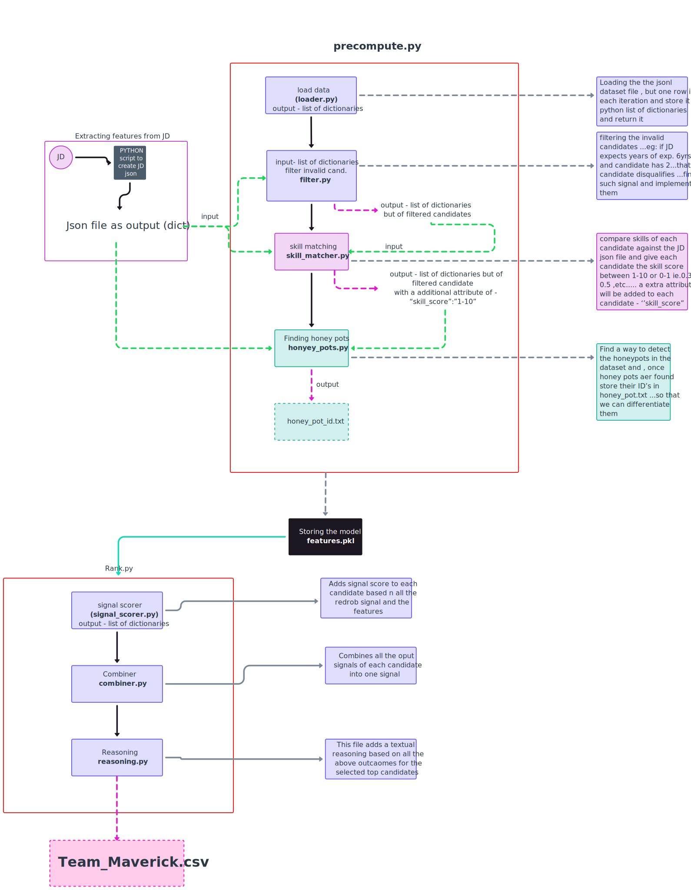

# Offline Resume Screener

An offline candidate-discovery pipeline for ranking resumes against a job description. It reads candidate data from a local JSONL file, extracts requirements from a local DOCX job description, filters and scores candidates, removes suspected honeypots, and writes the top 100 results as a CSV submission.

## Pipeline



```text
data/candidates.jsonl + data/job_description.docx
                    |
              precompute.py
                    |
       loader -> JD parser -> filter -> skill matcher -> honeypot detector
                    |
     data/precomputed/features.pkl
     data/precomputed/honeypot_ids.txt
     data/precomputed/jd_intent.json
                    |
                 rank.py
                    |
 signal scorer -> score combiner -> honeypot removal -> reasoning
                    |
        submission/team_xxx.csv
```

## Project structure

```text
.
├── data/
│   ├── candidates.jsonl          # Local candidate dataset (not committed)
│   └── job_description.docx      # Local job description
├── src/
│   ├── loader.py                 # Candidate loading and normalization
│   ├── jd_parser.py              # DOCX-to-JD-intent extraction
│   ├── filter.py                 # Experience/location eligibility checks
│   ├── skill_matcher.py          # JD-to-candidate skill matching
│   ├── honeypot_detector.py      # Suspicious-profile detection
│   ├── signal_scorer.py          # Behavioural signal scoring
│   ├── combiner.py               # Final-score calculation
│   └── reasoning.py              # Submission reasoning text
├── precompute.py
├── rank.py
├── requirements.txt
└── submission/team_xxx.csv
```

## Setup

Use Python 3.10 or newer.

```powershell
python -m venv .venv
.\.venv\Scripts\Activate.ps1
pip install -r requirements.txt
```

Place these input files locally before running the pipeline:

```text
data/candidates.jsonl
data/job_description.docx
```

The candidate dataset is intentionally ignored by Git because it is too large for GitHub.

## Run

First generate the scored candidate features and honeypot IDs:

```powershell
python precompute.py
```

Then rank candidates and create the submission file:

```powershell
python rank.py
```

The final output is written to:

```text
submission/team_xxx.csv
```

## Generated files

| File | Purpose |
| --- | --- |
| `data/precomputed/jd_intent.json` | Job requirements extracted from the DOCX |
| `data/precomputed/features.pkl` | Filtered candidates with skill features |
| `data/precomputed/honeypot_ids.txt` | IDs excluded from the final ranking |
| `submission/team_xxx.csv` | Ranked top-100 submission with reasoning |

## Offline execution

The runtime pipeline does not call APIs or use the internet. It operates only on local files. Package installation may require internet access if dependencies are not already available in the environment.
